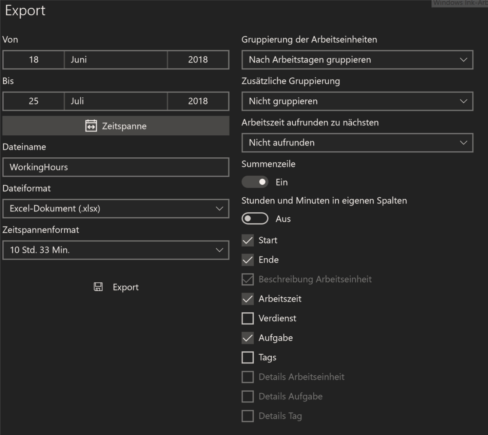

## WorkingHoursEdit
Editing excel files exported from working hours app on windows so they display vacation days, sick days and overtime.
Repository contains IntelliJIdea Java Project.

# Build with Maven:
mvn clean compile assembly:single

# Usage:
Build it as described above. Afterwards start the jar and specify your input and output files

java -jar WorkingHoursEdit-1.0-SNAPSHOT-jar-with-dependencies.jar input=InputFile.xlsx output=OutputFile.xlsx

# Troubleshooting
If some errors occur during execution try to change your export settings in the WorkingHours App
Settings should be as described in the following image:

